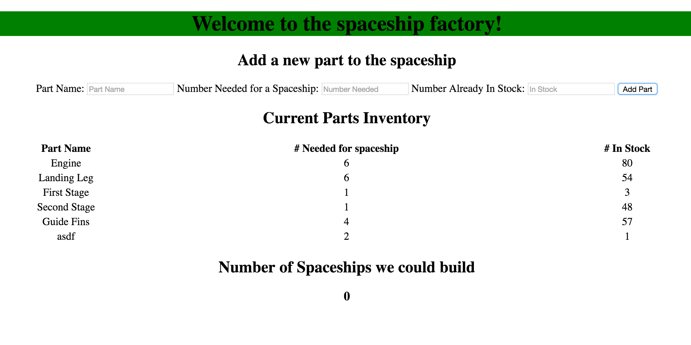

### Express Challenge
Rocket, The Router Rascal, has struck the spaceship factory. Per his calling card, he has only done damage to the spaceship factory's `app.js` file and files in the `routes` folder (all can be found in the `lib/server/` folder), so only make changes to those files. He couldn't help himself, and has left some punny hints behind.

## Getting Started

1. Fork this repository and clone your fork onto your computer.
2. Install the project's node dependencies by navigating to the project and running the command `npm install`
3. Run `npm start` to start the application. Go to `localhost:8000` to view it.
4. The current site is broken and has 6 errors that can be fixed by editing 6 lines of code. If you find yourself doing a major rewrite, you've probably gone too far.
4. When the site is back up and running, it should look like it did before. You should be able to add a new spaceship part to the list when everything is done.

